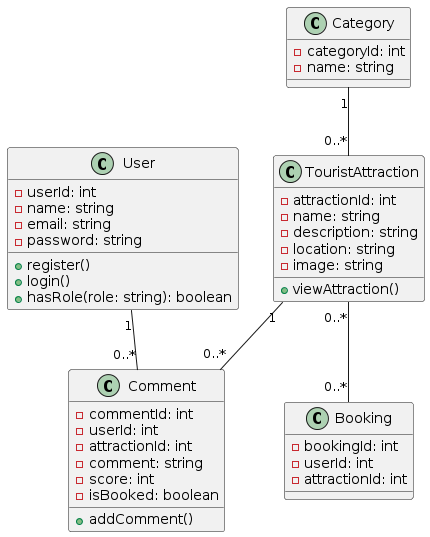
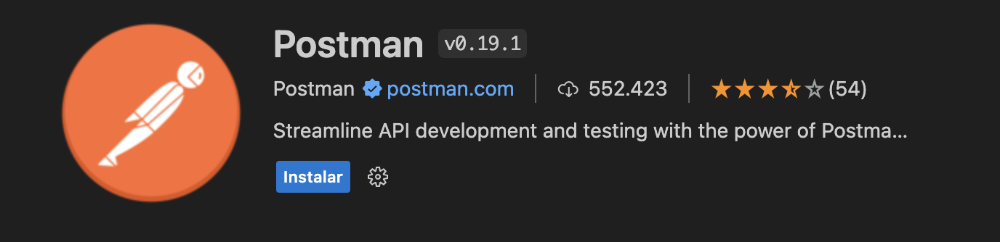

### RoamingRengerAPI

## Class Diagram



https://www.planttext.com

### Jueves 28 Intro a las API's

* Objetivos de la meet
* Un review rapido a donde se pretende llegar
* Tools que utilizaremos
* Conceptos de Verbos Http, swagger, UML
* revisar el codigo explicarlo
* Herramientas para testear las APIS
* Agregar nuevos endpoints
* Objetivos de la proxima clase?
  
### Para el proximo jueves

Generar los siguientes endpoints para la clase **TouristAttraction**:

|Verbo HTTP | Nombre|
|-----------|-------|
|POST|createAttraction|
|GET|getAttractionbyId|
|PUT|updateAttraction|
|DELETE|deleteAttraction|


```
class TouristAttraction {
    - attractionId: int
    - name: string
    - description: string
    - location: string
    - image: string
}
```

### Extension VSC para probar la API


### Como comenzar?
1. Instalar Node, MongoDb, git y de forma opcional Oh My Zsh, en este repositorio encontraras un archivo llamado TOOLS.md en el cual encontraras como se instalan los mismos.
2. hacer un **fork** de este repositorio para tener una copia de este repositorio y en la cual deberias trabajar.
3. Luego de hacer el **fork** del repositorio, se te genera una copia en tu github, clona ese repositorio en tu local y comenza a programar!
4. hacer un commit por cada endpoint antes mencionados.
5. cuando tengas los nuevos 4 endpoints funcionando deberias tener 4 commits, ahora pushea esos commit asi podemos revisar tu codigo en la proxima meeting.